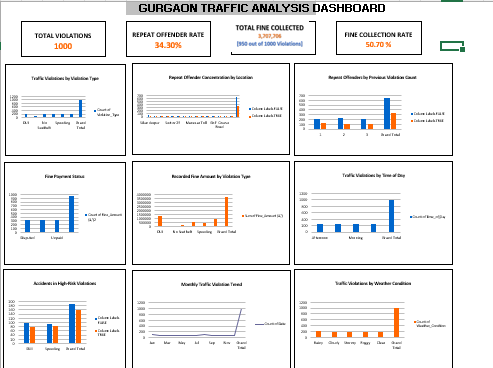
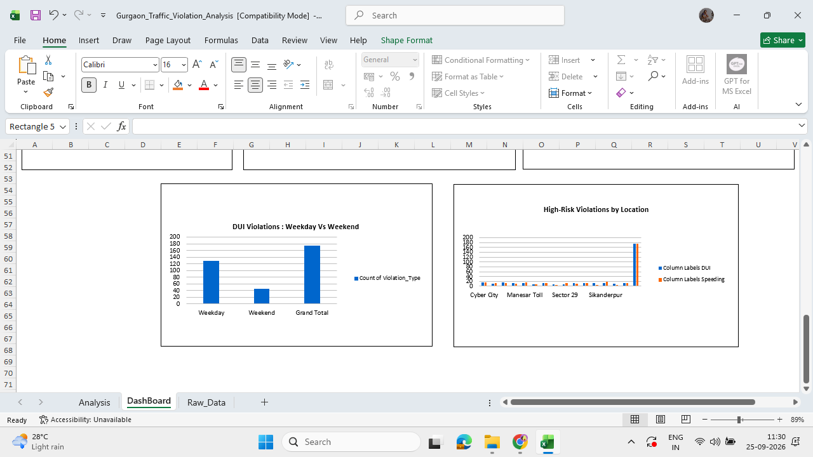
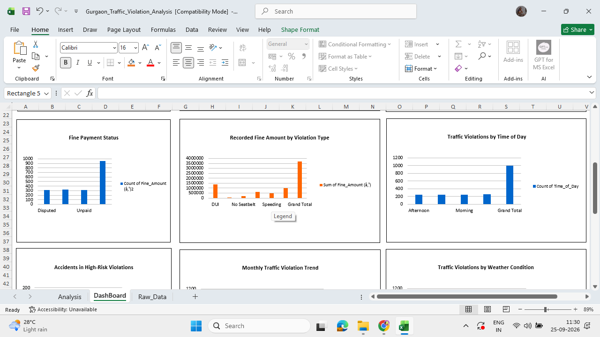

# Gurgaon Traffic Violation Analysis

## Project Overview
An Advanced Excel-based analysis of traffic violations in Gurgaon, designed to identify violation hotspots, repeat-offender patterns, fine collection trends, high-risk violations, and time-based enforcement patterns.
The project transforms raw traffic violation records into structured analysis and an interactive dashboard to support data-driven law-enforcement decision-making.

---

## Business Objective

The objective of this project is to analyze traffic violation data and identify patterns that can help enforcement teams:
- Identify locations with high concentrations of traffic violations
- Understand the most frequent violation types
- Analyze repeat-offender behavior
- Examine fine payment and collection patterns
- Identify high-risk violations associated with accidents
- Analyze traffic violations across time periods and weather conditions
- Identify locations with higher concentrations of DUI and speeding violations

---

## Dataset

The dataset contains **1,000 traffic violation records** from Gurgaon.

### Key fields

- Date
- Location
- Vehicle Type
- Violation Type
- Fine Amount
- Repeat Offender
- Weather Condition
- Time of Day
- Road Condition
- Driver Age Group
- Passengers Count
- Traffic Density
- License Status
- Accident Involved
- Speed Recorded
- Vehicle Registration State
- Officer ID
- Previous Violations
- Insurance Penalty
- Fine Payment Status
A derived `Day_Type` field was also created to classify records as **Weekday** or **Weekend**.

---

## Tools & Technologies

- Microsoft Excel
- PivotTables
- PivotCharts
- Excel formulas
- Data cleaning and validation
- Exploratory data analysis
- Dashboard development

---

## Data Preparation & Validation

The dataset was reviewed for data quality before analysis.

### Validation performed

- Checked total record count
- Checked for duplicate records
- Identified missing values
- Reviewed data types and categorical fields
- Identified potential fine-amount outliers using the IQR method
- Reviewed potential outliers against their surrounding context
- Created a `Day_Type` helper field for weekday/weekend analysis

### Missing Values

The dataset contains **50 missing Fine Amount values**.
These values were not imputed because the original fine amounts could not be reliably determined from the available information. Therefore, fine-related monetary analysis is based on the **950 records with recorded Fine Amount values**.
Potential Fine Amount outliers were reviewed and retained because they did not show obvious data-entry errors.

---

## Analysis Performed

### 1. Traffic Violation Hotspots

Analyzed violation counts across Gurgaon locations to identify areas with higher concentrations of recorded violations.

### 2. Violation Type Analysis

Compared the frequency of major violation types, including:
- Wrong-Side Driving
- No Seatbelt
- Red-Light Jump
- DUI
- Speeding
- No Helmet

### 3. Repeat Offender Analysis

Analyzed:
- Overall repeat-offender rate
- Repeat-offender concentration by location
- Repeat-offender counts by previous violation count

### 4. Fine Collection Analysis

Analyzed recorded fine amounts by:
- Fine payment status
- Violation type
Among the 950 records with recorded fine amounts:
- Paid: 324
- Unpaid: 315
- Disputed: 311
Excluding disputed cases, the recorded collection rate was **50.70%**.

### 5. Time-Based Analysis

Analyzed traffic violations by:
- Time of day
- Month
- Weekday vs weekend for DUI violations

### 6. Weather Analysis

Compared traffic violation counts across:
- Clear
- Cloudy
- Foggy
- Rainy
- Stormy

### 7. High-Risk Violation Analysis

Focused on **DUI and Speeding** to examine:
- Accident involvement
- High-risk violation concentration by location
- Weekday vs weekend DUI patterns

---

## Dashboard

The final Excel dashboard brings together the major findings using KPI cards and PivotCharts.

### Key KPIs

| KPI | Value |
|---|---:|
| Total Violations | 1,000 |
| Repeat Offender Rate | 34.30% |
| Recorded Fine Amount | ₹3,707,706 |
| Fine Collection Rate* | 50.70% |

\*Collection rate is calculated among paid and unpaid cases with recorded fine amounts, excluding disputed cases.

---

## Dashboard Preview

### Dashboard Overview

### High-Risk Analysis

### Fine & Enforcement Analysis

---

## Key Findings

- The dataset contains **1,000 traffic violation records** with no duplicate records identified.
- **34.30%** of records were classified as repeat offenders.
- **50** Fine Amount values were missing, so monetary analysis was performed using the **950 recorded fine amounts**.
- The total recorded fine amount was **₹3,707,706**.
- Among records with recorded fines, **324 were marked Paid, 315 Unpaid, and 311 Disputed**.
- Excluding disputed cases, the recorded fine collection rate was **50.70%**.
- DUI and Wrong-Side Driving together accounted for a substantial share of the recorded fine amount.
- Rainy conditions had the highest recorded number of violations among the weather categories.
- DUI and Speeding were analyzed as high-risk violation categories because of their association with accident involvement in the dataset.
- The analysis identified locations with higher concentrations of DUI and speeding violations for potential enforcement prioritization.

---

## Excel Skills Demonstrated

- Data cleaning and validation
- Missing-value analysis
- Duplicate detection
- IQR-based outlier identification
- Conditional formulas
- Date and weekday/weekend analysis
- PivotTables
- PivotCharts
- Aggregation and segmentation
- KPI development
- Dashboard design
- Business-oriented data interpretation

---

## Limitations

- The dataset does not provide traffic exposure measures such as vehicle volume by location or time. Therefore, higher violation counts should not automatically be interpreted as higher violation rates or greater risk.
- Missing Fine Amount values were not imputed and are excluded from monetary aggregations.
- The analysis identifies associations and patterns in the available data; it does not establish causation.
- Weather-related findings should not be interpreted as causal without additional exposure and traffic-volume data.

---

## Project Outcome

This project demonstrates the ability to transform raw operational data into structured analysis, identify meaningful business patterns, and communicate findings through an interactive Excel dashboard.
The analysis can support further investigation into enforcement hotspots, repeat-offender behavior, fine collection, and high-risk traffic violations.
